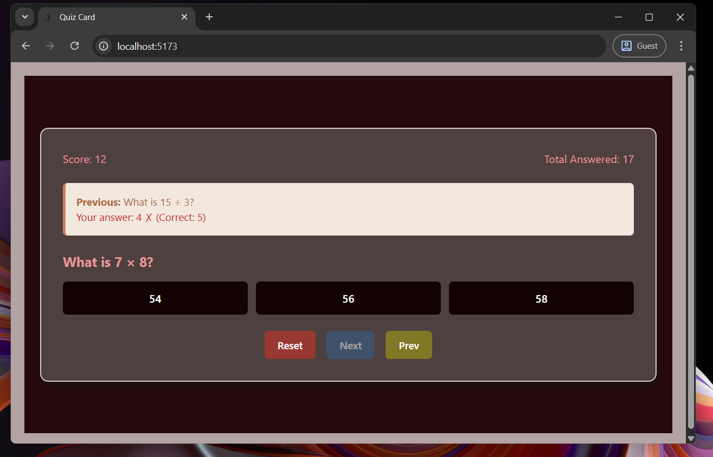
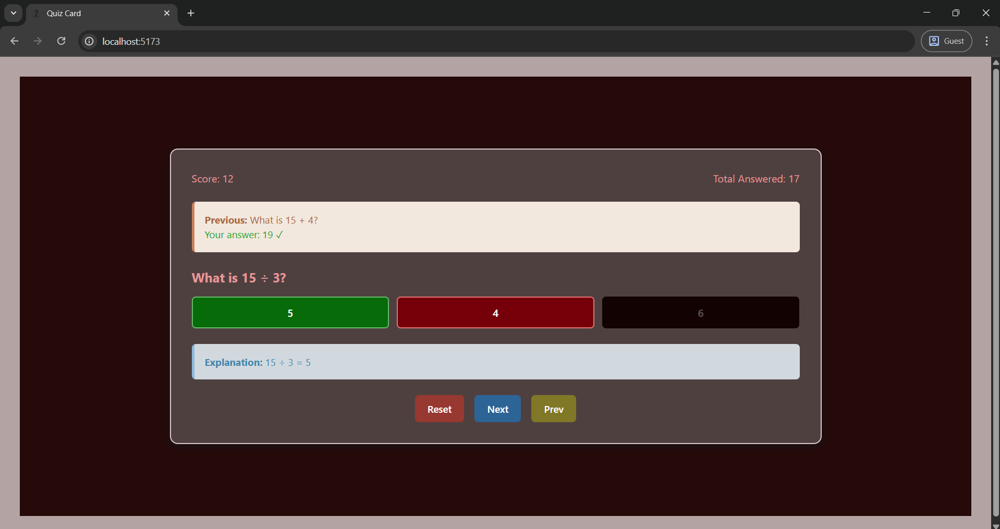
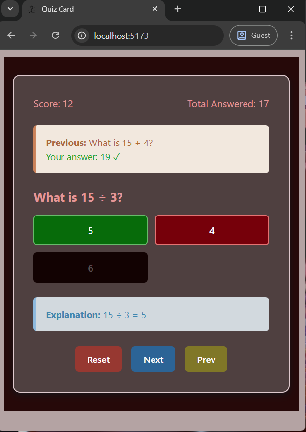
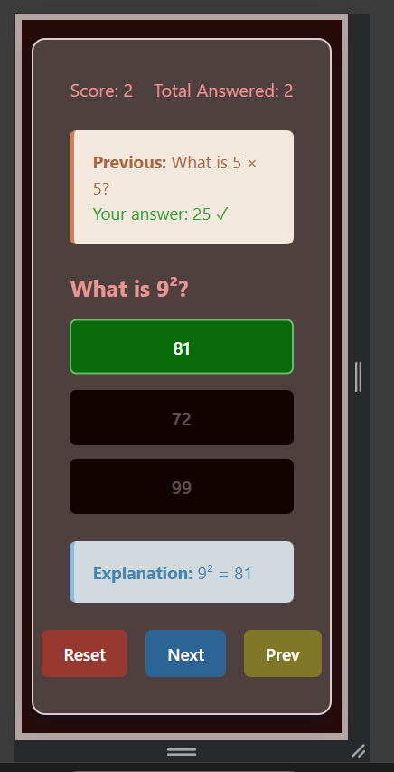

# 🧠 React Quiz App

An interactive and endless quiz application built with React. Supports dynamic score tracking, randomized questions, and explanation feedback. Designed for fun and learning!

## 🚀 Features

- ✅ Endless random questions
- ✅ Responsive and minimalist UI
- ✅ Explanation visible after answering
- ✅ Tracks score and total attempts
- ✅ Supports reset and navigation
- ✅ Built with **React**, **Vite**, and modern JavaScript

---

## 📸 Screenshots

Here’s what the app looks like:

### 💻 Desktop View

Float



Full Screen



Minimized



### 📱 Mobile View



---

## 🛠️ Technologies Used

- React
- Vite
- JavaScript (ES6+)
- html
- CSS (custom, modular)
- Git & GitHub (version control)

---

## 🧩 Folder Structure

```text
Quiz-React-app/
├── public/
│   └── quiz.svg               # Logo or assets
├── src/
│   ├── assets/
│   │   └── quizData.jsx       # Quiz question data
|   |── components/
│   │   └── button.jsx
│   │   └── button.css         # sub components
│   ├── App.jsx                # Main component
│   ├── App.css                # Global styling
│   ├── main.jsx               # Entry point
│   └── index.css              # Base styles
├── .gitignore
├── index.html                 # html
├── LICENSE
├── package.json
└── README.md
```

---

## 📦 Getting Started

### Prerequisites

Make sure you have Node.js and npm installed:

```bash
node -v
npm -v
```

### Install dependencies

```bash
npm install
```

### Start the app in dev mode

```bash
npm run dev
```

### Build for production

```bash
npm run build
```

---

## 📝 License

This project is licensed under the **Apache 2.0 License**.  
See the [LICENSE](./LICENSE) file for details.

---

## ✍️ Author

- 👤 **Ramprasanth T**
- 🔗 [GitHub Profile](https://github.com/01-Ramprasanth-T)
- 💬 Feel free to contribute or open issues

---

## ⭐️ Support / Contribute

If you like this project:

- Give it a ⭐️ on GitHub
- Fork and contribute new features or questions
- Suggest improvements via issues

Thanks for visiting and happy quizzing! 🧠💡

---
